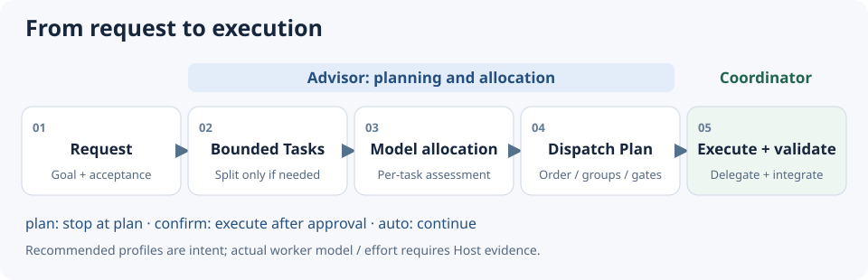

# Codex Route Advisor

English | [繁體中文](README.zh-TW.md)

Break down Codex development work, recommend model allocation, and produce an actionable Dispatch Plan.

## Purpose and features

- **Split only where needed**: create Bounded Tasks; a local implementation and its focused test usually stay together.
- **Allocate per task**: recommend a model, reasoning effort, and tools without escalating every task because one is difficult.
- **Make execution relationships explicit**: represent dependencies, parallel groups, and conditional work.
- **Optional Jev assessment**: use an independent backend, with Agent fallback when unavailable or low-confidence.



Advisor owns planning. The active Coordinator owns execution, delegation, retries, and final validation. The Skill does not switch the main chat model or control a Provider, Model Picker, or Proxy.

## Install

Use a Codex environment that loads Skills and Node.js capable of running `.mjs` files. The development baseline is Node.js 24.x; a minimum supported version has not been declared. Jev and an API key are optional.

Copy the package's `skill/` contents into:

```text
<project>/.agents/skills/codex-route-advisor/
├─ SKILL.md
├─ scripts/
├─ references/
└─ examples/
```

Keep the README and `docs/` at the package root; they are not installed into the Skill. For use across projects, install to `~/.agents/skills/codex-route-advisor/` at user scope (`%USERPROFILE%` on Windows), subject to your Host's actual discovery settings.

## Quick start

**1. Initialize in a Codex conversation for your Project:**

```text
$codex-route-advisor init
```

Choose Router, profiles, execution mode, escalation, and scope. For a first run, start with Agent assessment, `confirm`, escalation No, and Workspace scope. Initialization detects Jev credentials without a live verification call.

**2. Give it real work:**

```text
Use codex-route-advisor to implement the login API and its focused tests.
Show the Dispatch Plan first; diagnose the root cause only if the tests fail.
```

**3. Review the plan and approve execution.** The Coordinator implements and validates it. If the Host cannot run a requested worker profile, it should explain the alternative. Normal users do not author bridge JSON.

To inspect a plan without execution, use `$codex-route-advisor plan <task>`.

## Implicit selection and recurring use

The Host can select Advisor from its Skill description for new implementation, bug-fix, refactoring, migration, and development-planning requests without an explicit mention. General questions, progress checks, approval/continuation of an existing plan, retries, and assigned Worker execution do not start another planning pass. Replan when the request changes a routing boundary.

`enabled` defaults to `true` and controls Advisor after selection; it does not guarantee that the Host loads the Skill every time. Precedence is Session > Workspace > Global > Skill default. Session overrides apply only to the current conversation; Workspace / Global settings persist. For example, enter in a Codex conversation:

```text
$codex-route-advisor config enabled=false scope=workspace
$codex-route-advisor config enabled=true scope=session
```

Disabling bypasses Advisor before decomposition and produces no assessment, Dispatch Plan, or trace. Lifecycle commands remain available for inspection and re-enabling. `enabled=true` does not authorize automatic execution; `executionMode` and user authorization still apply.

To explicitly require recurring use, add this instruction to the project's `AGENTS.md` or the global `AGENTS.md` in Codex home (default `~/.codex/AGENTS.md`). For Claude environments, use `CLAUDE.md` only if that Host loads it and can access this Skill; Claude execution compatibility has not been verified here.

```text
Before each new implementation, bug-fix, refactoring, migration, or
development-planning request, use the installed codex-route-advisor and
resolve effective settings (Session > Workspace > Global > Skill default).
When enabled=false, follow the native workflow without Advisor decomposition,
assessment, Dispatch Plan, or trace. When enabled=true, produce the plan
according to the Skill, then respect executionMode, allowModelEscalation,
and user authorization.
Handle explicit lifecycle / planning commands first; do not re-enable implicitly.
Do not replan for general questions, progress checks, approval/continuation
of an existing plan, retries, or assigned Worker execution.
Replan only when the request changes a routing boundary.
If the Skill is unavailable, report it and follow the user's direction;
do not claim Advisor ran.
```

This is a persistent Coordinator instruction, not a runtime hook. Verify loading in a new conversation after adding it. Guaranteed programmatic interception requires separate Host integration.

## Commands

Enter these commands in a Codex conversation; the Coordinator handles them.

| Command | Purpose |
| --- | --- |
| `init` | Guided setup or configuration update |
| `config [changes]` | Inspect effective settings and sources, or patch selected fields |
| `status` | Read-only Advisor, Jev, and model compatibility status |
| `reset [workspace\|global]` | Remove the selected scope's configuration after confirmation |
| `verify [jev-live]` | Local checks; a live probe only with explicit `jev-live` |
| `plan <task>` | Produce a plan for this session without execution |

Prefix each command with `$codex-route-advisor`, for example `$codex-route-advisor status`. See [Operations and troubleshooting](docs/en/operations.md) for full behavior.

## Model allocation and execution

| Tier | Default model / effort | Typical work |
| --- | --- | --- |
| Fast | `gpt-6-luna / high` | Clear, local, low-ambiguity work |
| Balanced | `gpt-6.1-sol / medium` | Ordinary engineering judgment and bounded design |
| Strong | `gpt-6.1-sol / xhigh` | Unknown root cause, hypothesis testing, deep diagnosis |
| Long | `gpt-6-astra / medium` | Broad context, migration, rollout, sustained planning |

By default, `allowModelEscalation=false`: the Coordinator **model and effort** selected in the Host are the allocation ceiling. With GPT-6.1 Sol / Medium selected, Fast can use Luna / High, while Strong and Long are capped to Sol / Medium; the original preferred recommendation is retained. Set this option explicitly to `true` to allow upward allocation.

| Execution mode | Behavior |
| --- | --- |
| `plan` | Stop after producing the plan |
| `confirm` (default) | Show the plan and execute after approval |
| `auto` | Show a concise plan and continue execution |

A recommendation is not proof that the runtime used that model. Actual worker model/effort depends on Host capability and verifiable runtime evidence. Work executed locally by the Coordinator uses its current model.

## Routing simulation and token budget

Assume an Astra / Medium Coordinator planning a product search feature: API and UI implementation plus their focused tests → Sol / Medium; API documentation → Luna / Max (an explicit Session override); cross-service rollout / rollback planning → Astra / Medium. The Luna default remains High; real use requires Host-supported models and efforts.


**Manually assumed budgets, not measured savings:** 100k versus 85k gives a 15% reduction under this example's assumptions. The mixed total includes Advisor planning, handoffs, integration, and validation. Model substitution alone does not establish token savings, and overhead can eliminate them. This is separate from pricing and subscription quotas.

See [the full simulation](docs/en/routing-simulation.md) for the prompt, task dependencies, input / output budgets, formula, and overhead sensitivity. This is a documentation example; no automatic token estimator was added.

## Documentation and feedback

- [Configuration](docs/en/configuration.md): fields, defaults, locations, precedence, and examples.
- [Operations and troubleshooting](docs/en/operations.md): commands, Jev, updates/removal, traces, and issue reporting.
- [CHANGELOG](CHANGELOG.md): additions, fixes, and user-visible changes.
- [Skill instructions](skill/SKILL.md): instructions loaded by the Agent.

For issue reports, include Host/version, the original prompt, expected and actual results, and sanitized plan or trace evidence. Do not include API keys or private source code. Development tests and manual acceptance records stay in the development repository and are excluded from the Skill distribution.

MIT — [LICENSE](LICENSE).
