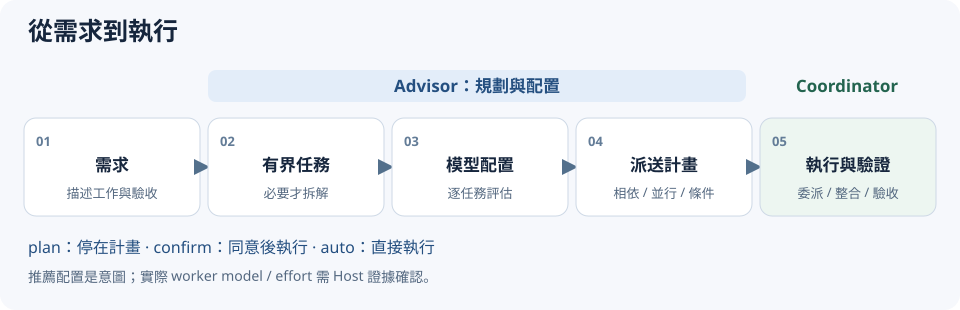
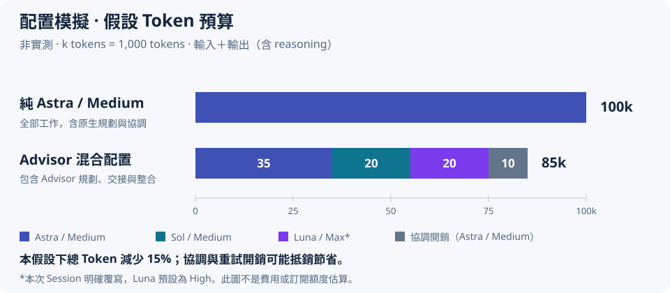

# Codex Route Advisor

[English](README.md) | 繁體中文

為 Codex 開發工作拆解任務、建議模型配置，並產生可執行的派送計畫。

## 用途與功能

- **必要才拆解**：將需求拆成有界任務（Bounded Tasks），局部實作與 focused test 通常維持同一任務。
- **逐任務配置**：依工作需要建議模型、推理強度與工具，不因單一困難任務升級整個需求。
- **明確執行關係**：派送計畫（Dispatch Plan）列出相依、可並行與條件式工作。
- **Jev 選用**：可使用獨立 assessment；不可用或信心不足時由 Agent fallback。



Advisor 負責規劃；目前的協調器（Coordinator）負責執行、委派、重試與最終驗證。Skill 不切換主聊天模型，也不控制 Provider、Model Picker 或 Proxy。

## 安裝

需要可載入 Skill 的 Agent 環境，以及可執行 `.mjs` 的 Node.js。開發基線為 Node.js 24.x；尚未宣告最低支援版本。Jev 與 API key 均非必要。

建議使用 Skills CLI 安裝（需有 Node.js / npm）。在專案目錄執行以下指令，即為專案層級安裝：

**Codex：**

```bash
npx skills add kenming/codex-route-advisor -a codex -y
```

**目前僅支援 Codex。** 不支援 Claude Code，請勿使用 `-a claude-code` 安裝目標。

若要安裝至使用者層級，請在 Codex 安裝指令中加上 `-g`。

**手動安裝（備選）：** 將套件中的 `skill/` 內容複製至：

```text
<project>/.agents/skills/codex-route-advisor/
├─ SKILL.md
├─ scripts/
├─ references/
└─ examples/
```

README 與 `docs/` 留在套件根目錄，不需複製進 Skill。若要供所有 Project 使用，可安裝至使用者層級的 `~/.agents/skills/codex-route-advisor/`；Windows 的 `~` 為 `%USERPROFILE%`。以實際 Host 的 discovery 設定為準。

## 快速開始

**1. 在 Project 的 Codex 對話初始化：**

```text
$codex-route-advisor init
```

依引導選 Router、profiles、執行模式、向上調度與 scope。建議首次選 Agent assessment、`confirm`、向上調度 No、Workspace。初始化只偵測 Jev credential，不自動做 live 驗證。

**2. 交付真實任務：**

```text
使用 codex-route-advisor 實作登入 API 與 focused tests。
先顯示 Dispatch Plan；只有測試失敗時才診斷根因。
```

**3. 檢視計畫後同意執行。** Coordinator 按計畫實作並驗證；若 Host 無法使用指定 worker profile，應說明替代方式。一般使用者不需撰寫 bridge JSON。

只想先看計畫，可直接使用 `$codex-route-advisor plan <任務>`。

## 隱含啟用與持續呼叫

新的實作、修復、重構、遷移與開發規劃需求，可由 Host 依 Skill description 隱含選用 Advisor，無須每次具名呼叫。一般問答、進度查詢、批准／延續既有計畫、重試與 Worker 執行不重新規劃；需求改變 routing boundary 時才重新規劃。

`enabled` 預設 `true`，控制 Skill 被選用後是否執行，不保證 Host 每次自動載入。優先序為 Session > Workspace > Global > Skill default；Session 僅限目前對話，Workspace / Global 持續保存。例如在 Codex 對話輸入：

```text
$codex-route-advisor config enabled=false scope=workspace
$codex-route-advisor config enabled=true scope=session
```

關閉後在 decomposition 前完整 bypass，不產生 assessment、Dispatch Plan 或 trace；仍可使用 lifecycle commands 查詢與重新設定。`enabled=true` 不等於自動執行，後續仍依 `executionMode` 與授權處理。

若要明確要求 Codex 的 Coordinator 持續呼叫，可將以下提示詞加入專案 `AGENTS.md`，或 Codex home 的全域 `AGENTS.md`（預設 `~/.codex/AGENTS.md`）。

```text
處理每個新的開發實作、修復、重構、遷移或開發規劃需求前，
使用已安裝的 codex-route-advisor，先解析有效設定
（Session > Workspace > Global > Skill default）。
enabled=false 時維持原生流程，不做 Advisor decomposition、
assessment、Dispatch Plan 或 trace；enabled=true 時依 Skill 產生計畫，
再遵守 executionMode、allowModelEscalation 與使用者授權。
明確 lifecycle / planning commands 優先依 Skill 處理，不自行重新啟用。
一般問答、進度查詢、批准／延續既有計畫、重試與 Worker 執行
不重新規劃；需求改變 routing boundary 時才重新規劃。
Skill 不可用時回報並依使用者指示處理，不宣稱已執行 Advisor。
```

這是 Coordinator 的持續指令，不是 runtime hook。新增持續指令後，以新對話驗證 Host 是否載入；若要求每次必定由程式攔截，需要另做 Host 整合。

## 主要指令

以下指令輸入在 Codex 對話中，由 Coordinator 處理。

| 指令 | 用途 |
| --- | --- |
| `init` | 引導初始化或更新設定 |
| `config [changes]` | 檢視有效設定／來源，或修改指定欄位 |
| `status` | 唯讀檢視 Advisor、Jev 與模型相容性 |
| `reset [workspace\|global]` | 確認後移除指定 scope 的設定 |
| `verify [jev-live]` | 本機檢查；明確指定 `jev-live` 才做 live probe |
| `plan <任務>` | 本次只產生計畫，不執行 |

每項前加 `$codex-route-advisor`，例如 `$codex-route-advisor status`。完整行為見[操作與排錯](docs/zh_TW/operations.md)。

## 模型配置與執行行為

| Tier | 預設模型／推理強度 | 適用工作 |
| --- | --- | --- |
| Fast | `gpt-6-luna / high` | 明確、局部、低歧義工作 |
| Balanced | `gpt-6.1-sol / medium` | 一般工程判斷與局部設計 |
| Strong | `gpt-6.1-sol / xhigh` | 根因未知、假設驗證與深度診斷 |
| Long | `gpt-6-astra / medium` | 廣上下文、migration、rollout 等長程工作 |

預設 `allowModelEscalation=false`：Host 選定的 Coordinator **model＋effort** 是配置上限。假設選擇 GPT-6.1 Sol / Medium，Fast 可使用 Luna / High；Strong、Long 的 effective profile 會限制為 Sol / Medium，原始 preferred recommendation 仍保留。明確設為 `true` 才允許向上調度。

| 執行模式 | 行為 |
| --- | --- |
| `plan` | 產生計畫後停止 |
| `confirm`（預設） | 顯示計畫，同意後執行 |
| `auto` | 顯示簡短計畫後直接執行 |

推薦配置不代表實際已使用該模型。worker 是否採用指定 model／effort，取決於 Host 能力與可驗證的執行證據；由 Coordinator 本地執行時，使用其目前選定的模型。

## 配置模擬與 Token 預算

假設 Coordinator 為 Astra / Medium，規劃產品搜尋功能：API、介面實作與各自的 focused tests → Sol / Medium；API 文件 → Luna / Max（本次 Session 明確覆寫）；跨服務上線／回復規劃 → Astra / Medium。Luna 預設仍為 High，實際使用須由 Host 確認模型與 effort 支援。



**人工假設預算，非實測節省：** 100k 對比 85k，在本例假設下減少 15%。混合總額已包含 Advisor 規劃、交接、整合與驗證；換模型本身不能證明 Token 節省，協調開銷也可能抵銷節省。此數字與 API 費用或訂閱額度分開看待。

完整提示詞、task dependencies、輸入／輸出預算、公式與開銷敏感度見[配置模擬文件](docs/zh_TW/routing-simulation.md)。這是文件示例，未新增自動 Token 估算功能。

## 詳細文件與回饋

- [設定說明](docs/zh_TW/configuration.md)：欄位、預設值、設定路徑、優先順序與範例。
- [操作與排錯](docs/zh_TW/operations.md)：指令流程、Jev、更新／移除、trace 與問題回報。
- [CHANGELOG](CHANGELOG.md)：新增、修正與使用者可見變更。
- [Skill 執行規範](skill/SKILL.md)：Agent 實際載入的指令。

回報時附上 Host／版本、原始 prompt、預期與實際結果，以及去敏感資訊的計畫或 trace；不要提供 API key 或私人程式碼。開發用測試與人工驗證紀錄保留於開發 repository，不隨 Skill 發佈。

MIT — [LICENSE](LICENSE)。
