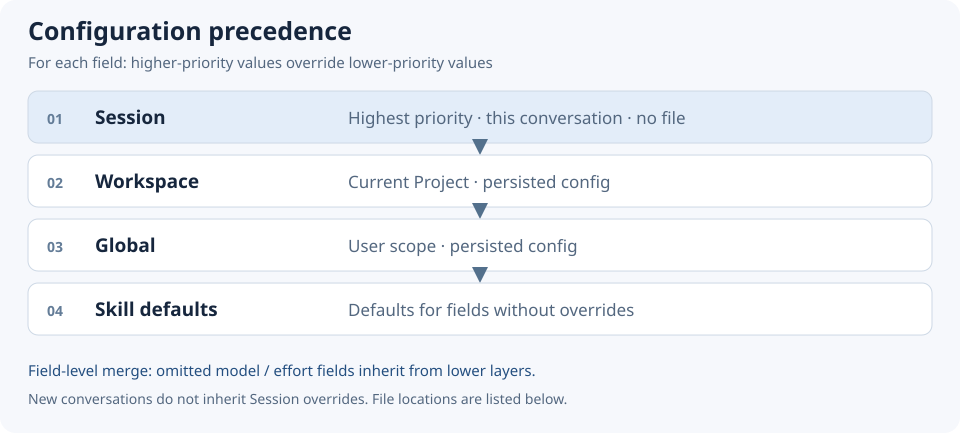

# Configuration

[README](../../README.md) | [Operations and troubleshooting](operations.md) | [繁體中文](../zh_TW/configuration.md)

Use `$codex-route-advisor init` for guided setup or `config` to inspect and update settings. Normal users do not need to edit JSON. Effective settings may differ from Skill defaults; inspect their sources with `config`.

## Scope, locations, and precedence



Fields merge independently. A field omitted at a higher scope inherits from a lower scope. Session overrides apply only to the current conversation, are not written to disk, and do not carry into new conversations.

| Scope | Configuration location |
| --- | --- |
| Session | Current conversation override; no file |
| Workspace | `<project>/.codex/codex-route-advisor/config.json` |
| Global / Windows | `%LOCALAPPDATA%\codex-route-advisor\config.json` |
| Global / macOS | `~/Library/Application Support/codex-route-advisor/config.json` |
| Global / Linux | `$XDG_CONFIG_HOME/codex-route-advisor/config.json`, falling back to `~/.config/codex-route-advisor/config.json` |

A missing config file is valid. Skill installation and configuration scope are separate: a globally installed Skill can use each Project's Workspace settings.

## Fields and defaults

Persisted files use strict JSON and require `schemaVersion: 1`. Each scope can omit fields it does not override.

| Field | Values / type | Skill default | Meaning |
| --- | --- | --- | --- |
| `schemaVersion` | `1` | Required in files | Configuration format version |
| `enabled` | boolean | `true` | Advisor master switch |
| `executionMode` | `plan / confirm / auto` | `confirm` | Coordinator behavior after planning |
| `allowModelEscalation` | boolean | `false` | Allow allocation above the Coordinator profile |
| `router.backend` | `model / auto / jev` | `model` | Routing assessment backend; `model` means Agent |
| `router.prefer` | `model / jev` | Unset | Preference in `auto`; Agent unless Jev is preferred |
| `routing.<tier>.model` | Nonempty model id or supported family reference | See below | Override a tier's recommended model |
| `routing.<tier>.effort` | `low / medium / high / xhigh / max` | See below | Override a tier's reasoning effort |

`<tier>` is one of `fast / balanced / strong / long`. API keys are not stored here. `scope` and `workspaceRoot` are operation arguments, not persisted preferences. Bridge parameters such as confidence threshold are not fields in this config schema.

| Tier | Default model | Default effort |
| --- | --- | --- |
| `fast` | `gpt-6-luna` | `high` |
| `balanced` | `gpt-6.1-sol` | `medium` |
| `strong` | `gpt-6.1-sol` | `xhigh` |
| `long` | `gpt-6-astra` | `medium` |

Host availability, supported efforts, and exact-id policy still apply. Luna's Advisor effort floor is `high`; Host-specific `ultra` is outside Advisor's vocabulary. New models are not automatically classified or promoted into defaults based on their name or version.

## Assessment choices

| Setting | Behavior |
| --- | --- |
| `router.backend=model` | Agent assessment without Jev |
| `router.backend=auto`, `router.prefer=jev` | Prefer Jev; Agent fallback on failure, unavailability, or low confidence |
| `router.backend=jev` | Explicit Jev selection with Agent fallback retained |

Selecting Jev-assisted during initialization writes `auto + prefer=jev`. This is opt-in, not the Skill default. See [Jev setup and verification](operations.md#jev-setup-and-verification).

## Execution and disabling Advisor

- `plan`: complete assessment and plan validation, then stop; an Advisor trace is still created.
- `confirm`: show the plan and obtain explicit approval before execution.
- `auto`: show a concise plan and continue Coordinator execution/delegation.
- `enabled=false`: bypass Advisor before decomposition for normal development work; no assessment, recommendation, Dispatch Plan, or new Advisor trace.

"Plan only this time" is a Session override. Persist to Workspace or Global only when explicitly requested. `enabled=false` and `plan` have different effects.

## Model ceiling

With `allowModelEscalation=false`, the Coordinator supplies its actual Host-selected model and effort rather than guesses. If the preferred profile exceeds that ceiling, the plan preserves the preferred values and `constraint=model_escalation_disabled`; the effective profile becomes the Coordinator profile.

Within a family, effort is compared; across families, capability is compared. Sol / Medium can allocate lower-family Luna / High. Setting `true` removes the ceiling, subject to availability and Host delegation support. It neither switches the main chat model nor proves the requested profile was used.

## Common examples

**Change only the current conversation:**

```text
$codex-route-advisor init
Apply executionMode=plan to this Session only; preserve other settings.
```

**Change one Project field:**

```text
$codex-route-advisor config
Set only Workspace allowModelEscalation=true, preserve other settings, and save.
```

**Agent-only Workspace file:**

```json
{
  "schemaVersion": 1,
  "router": { "backend": "model", "prefer": "model" },
  "executionMode": "confirm",
  "allowModelEscalation": false
}
```

**Jev-assisted with a partial profile override:**

```json
{
  "schemaVersion": 1,
  "router": { "backend": "auto", "prefer": "jev" },
  "routing": { "balanced": { "effort": "high" } }
}
```

The omitted `balanced.model` inherits from a lower layer. Same-scope updates patch only specified fields rather than rewriting others with defaults. Use `reset`, not reinitialization, to remove a scope's configuration.

Invalid JSON, tiers, models, or efforts must produce explicit errors. See the [config schema](../../skill/references/config.schema.json) and Agent [configuration contract](../../skill/references/configuration.md).
