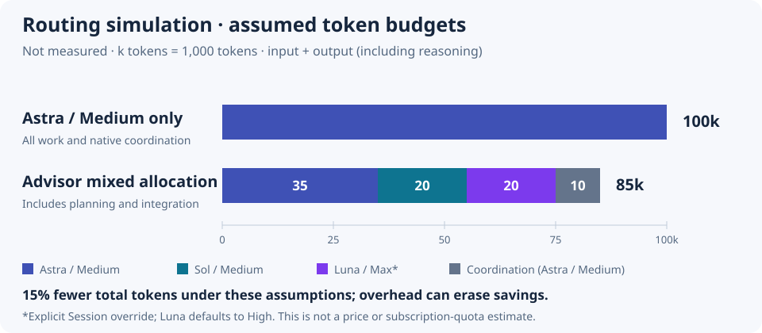

# Routing simulation and token budget

[README](../../README.md) | [繁體中文](../zh_TW/routing-simulation.md)

**This is an illustration with manually assigned budgets, not a measurement, benchmark, or savings promise.** Model allocation and token budgets are shown separately: using a smaller model does not automatically reduce tokens. This example demonstrates comparison, not a built-in Advisor token estimator.

## Simulation conditions and prompt

Assume a `gpt-6-astra / medium` Coordinator, `enabled=true`, `executionMode=plan`, and `allowModelEscalation=false`. Explicitly override Fast effort to `max` for this Session; the Skill default remains Luna / High. Assume the Host offers all listed models and efforts and can apply the recommended Worker profiles. These are simulation assumptions, not discovery results or execution evidence from the current Host.

```text
Use codex-route-advisor for a routing simulation. Produce a plan only; do not execute.
Simulate the Coordinator as gpt-6-astra / medium; do not change the Host picker.
For this Session, use enabled=true, executionMode=plan,
allowModelEscalation=false, and override Fast profile effort to max.
Keep other Skill defaults and do not persist configuration.

Add search to an existing product system:
1. Fix the search API contract, implement the API, and complete focused tests.
2. Implement the search UI and focused tests against that fixed contract.
3. Update API usage documentation and examples against that fixed contract.
4. Integrate cross-service validation and plan staged rollout, monitoring,
   and rollback procedures.

Produce Bounded Tasks, dependencies, and per-task model / effort recommendations.
Separate simulated advice from actual execution evidence. Do not start Workers,
call Jev, or write configuration or an execution trace.
```

This is a documentation simulation, not an executable workflow supplied with invented Host facts as its actual `coordinatorProfile`. In real use, obtain the current model / effort, availability, and supported efforts from the Host. If Luna / Max is unsupported, report it and adjust allocation; do not claim dispatch occurred.

## Allocation and dependencies

| Task | Work / acceptance | Tier | Simulated model / effort | Dependencies |
| --- | --- | --- | --- | --- |
| T1 | Fix the search API contract, implement the API, and pass focused tests | balanced | `gpt-6.1-sol / medium` | None |
| T2 | Complete the search UI and focused tests against the contract | balanced | `gpt-6.1-sol / medium` | T1 |
| T3 | Complete API usage documentation with contract-valid examples | fast | `gpt-6-luna / max` | T1 |
| T4 | Cross-service validation and staged rollout / rollback plan with monitoring and acceptance criteria | long | `gpt-6-astra / medium` | T2, T3 |

T2 and T3 are a candidate parallel group: they change different files, share a fixed contract, and can be accepted independently. Each implementation stays with its own focused test. This is a plausible hand-authored example, not output from an actual `advise-task.mjs` invocation; real advice depends on the request, rubric, and effective settings.

## Budget comparison

Unit: k tokens, or 1,000 tokens. Both scenarios assume the same initial repository, scope, and acceptance quality. The baseline uses Astra / Medium throughout. The mixed scenario retains Astra for coordination and long-horizon planning and uses the allocation above for other tasks.



| Scenario / item | Model / effort | Input | Output (including reasoning) | Total |
| --- | --- | ---: | ---: | ---: |
| Baseline: all work, including native planning and validation | Astra / Medium | 60 | 40 | **100** |
| Mixed T1 | Sol / Medium | 7 | 5 | 12 |
| Mixed T2 | Sol / Medium | 5 | 3 | 8 |
| Mixed T3 | Luna / Max | 12 | 8 | 20 |
| Mixed T4 | Astra / Medium | 20 | 15 | 35 |
| Mixed coordination: Advisor planning, handoffs, integration, final validation | Astra / Medium | 6 | 4 | 10 |
| **Mixed total** | — | **50** | **35** | **85** |

These budgets were manually assigned to illustrate the calculation. No fixed savings coefficient is assigned to any model or effort. The gray coordination segment also uses Astra: total mixed Astra usage is 35 + 10 = 45k. A 55% reduction in Astra usage must not be presented as a 55% reduction in total tokens.

```text
Mixed total = Sol 20k + Luna 20k + Astra work 35k + Astra coordination 10k = 85k
Total token reduction = 1 − mixed total / baseline total
                      = 1 − 85 / 100 = 15% (under these assumptions only)
```

Input includes repeated context and tool results; output includes reasoning. Cached input still counts as input tokens, although its cost may differ. API reasoning tokens are already included in `output_tokens` and must not be added twice. [OpenAI reasoning usage documentation](https://developers.openai.com/api/docs/guides/reasoning).

## Overhead sensitivity and limits

Keep mixed work at 75k and vary only coordination, repeated context, or retry overhead. The following are assumed scenarios, not statistical confidence intervals.

| Coordination / retry overhead | Mixed total | Versus baseline 100k |
| ---: | ---: | --- |
| 10k | 85k | 15% reduction |
| 25k | 100k | No savings |
| 40k | 115k | 15% increase |

Work tokens also vary with models, effort, context, and retries, so a Dispatch Plan alone cannot establish a reliable savings percentage. Token differences are separate from monetary cost or subscription quota consumption. This example assumes no API prices and makes no Codex subscription quota estimate.

For a measured comparison, run both scenarios against the same initial repository and acceptance criteria. Collect input / output usage for every Coordinator, Worker, and assessment call, including failures and retries, along with actual model / effort and quality results. Keep the label “estimate” if complete usage is unavailable; task counts and recommended profiles do not replace measured tokens. This example uses Agent assessment and no Jev calls; a measurement using Jev must report its usage and cost separately.
