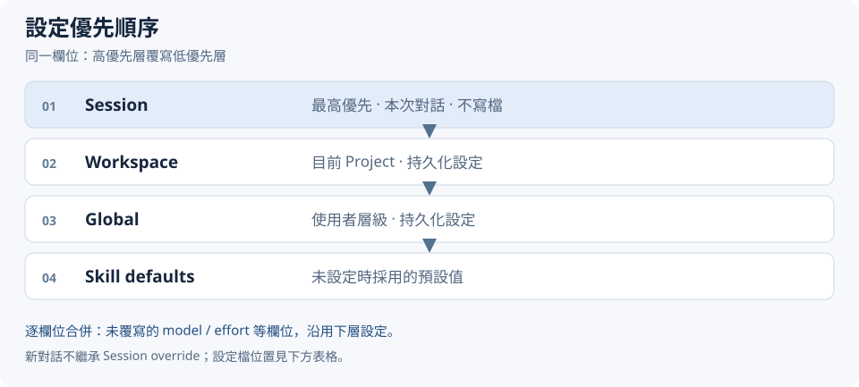

# 設定說明

[README](../../README.zh-TW.md) | [操作與排錯](operations.md) | [English](../en/configuration.md)

透過 `$codex-route-advisor init` 引導設定，或用 `config` 查詢／修改；一般使用者不需直接編輯 JSON。Skill defaults 與你目前有效的設定可能不同，請用 `config` 查看來源。

## Scope、路徑與優先順序



每個欄位獨立合併，較高層未提供的欄位沿用下層。Session 僅限本次對話，不寫檔，也不帶入新對話。

| Scope | 設定位置 |
| --- | --- |
| Session | 當前對話 override，無設定檔 |
| Workspace | `<project>/.codex/codex-route-advisor/config.json` |
| Global / Windows | `%LOCALAPPDATA%\codex-route-advisor\config.json` |
| Global / macOS | `~/Library/Application Support/codex-route-advisor/config.json` |
| Global / Linux | `$XDG_CONFIG_HOME/codex-route-advisor/config.json`；未設定時為 `~/.config/codex-route-advisor/config.json` |

設定檔不存在是合法狀態。Skill 安裝位置與設定位置是兩件事；Global Skill 也可以使用各 Project 的 Workspace 設定。

## 欄位與預設值

持久化檔案使用 strict JSON，並需包含 `schemaVersion: 1`。各 scope 不必寫出全部欄位。

| 欄位 | 值／型別 | Skill default | 說明 |
| --- | --- | --- | --- |
| `schemaVersion` | `1` | 檔案必填 | 設定格式版本 |
| `enabled` | boolean | `true` | Advisor 總開關 |
| `executionMode` | `plan / confirm / auto` | `confirm` | 計畫產生後的 Coordinator 行為 |
| `allowModelEscalation` | boolean | `false` | 是否允許高於目前 Coordinator profile 的配置 |
| `router.backend` | `model / auto / jev` | `model` | routing assessment backend；`model` 表示 Agent |
| `router.prefer` | `model / jev` | 未設定 | `auto` 時的偏好；未偏好 Jev 時使用 Agent |
| `routing.<tier>.model` | 非空 model id 或支援的 family reference | 見下表 | 覆寫特定 tier 的推薦模型 |
| `routing.<tier>.effort` | `low / medium / high / xhigh / max` | 見下表 | 覆寫特定 tier 的推理強度 |

`<tier>` 只允許 `fast / balanced / strong / long`。API key 不保存於設定檔；`scope`、`workspaceRoot` 是設定操作參數，不是持久化欄位。confidence threshold 等 bridge 參數也不是本 config schema 的設定欄位。

| Tier | model default | effort default |
| --- | --- | --- |
| `fast` | `gpt-6-luna` | `high` |
| `balanced` | `gpt-6.1-sol` | `medium` |
| `strong` | `gpt-6.1-sol` | `xhigh` |
| `long` | `gpt-6-astra` | `medium` |

Host availability、supported efforts 與 exact-id policy 仍須符合。Luna 的 Advisor effort 下限為 `high`；Host 暴露的 `ultra` 不在 Advisor effort 值域。未知新模型不會因名稱或版本較新而自動分類、取代 defaults。

## Assessment 選擇

| 設定 | 行為 |
| --- | --- |
| `router.backend=model` | Agent assessment，不使用 Jev |
| `router.backend=auto`、`router.prefer=jev` | 優先 Jev，失敗／不可用／低信心時 Agent fallback |
| `router.backend=jev` | 明確選 Jev，仍保留 Agent fallback |

初始化選「Jev-assisted」會寫入 `auto + prefer=jev`；這是選用配置，不是 Skill default。Jev 啟用方式見[操作與排錯](operations.md#jev-啟用與驗證)。

## 執行模式與停用

- `plan`：完整 assessment 與計畫驗證後停止，仍建立 Advisor trace。
- `confirm`：顯示計畫，取得明確同意後才執行。
- `auto`：顯示簡短計畫後由 Coordinator 繼續執行／委派。
- `enabled=false`：一般開發任務在 decomposition 前完整 bypass；不做 assessment、recommendation、Dispatch Plan 或新增 Advisor trace。

「這次只規劃」屬 Session override；只有明確要求持久化才寫 Workspace / Global。`enabled=false` 與 `plan` 的效果不同。

## 模型上限

`allowModelEscalation=false` 時，Coordinator 使用 Host 實際選定的 model＋effort 作比較，不可猜測。若 preferred profile 超過上限，計畫保留 preferred 資訊與 `constraint=model_escalation_disabled`，effective profile 改用 Coordinator。

同 family 比較 effort；跨 family 比較能力層級，因此 Sol / Medium 可以分配較低 family 的 Luna / High。`true` 解除此限制，但仍須滿足 availability 與 Host delegation 能力。設定不切換主聊天模型，也不保證 Host 已採用推薦配置。

## 常用範例

**只改本次對話：**

```text
$codex-route-advisor init
這次只套用 Session：executionMode=plan，其餘設定保留。
```

**只修改 Project 的一個欄位：**

```text
$codex-route-advisor config
只將 Workspace 的 allowModelEscalation 改為 true，其餘設定保留，請儲存。
```

**Agent-only Workspace 設定檔：**

```json
{
  "schemaVersion": 1,
  "router": { "backend": "model", "prefer": "model" },
  "executionMode": "confirm",
  "allowModelEscalation": false
}
```

**Jev-assisted 與局部 profile override：**

```json
{
  "schemaVersion": 1,
  "router": { "backend": "auto", "prefer": "jev" },
  "routing": { "balanced": { "effort": "high" } }
}
```

未提供的 `balanced.model` 沿用下層；同一 scope 更新也採 patch semantics，不用 defaults 重寫其他欄位。要刪除整個 scope 的設定請用 `reset`，不是重新 `init`。

無效 JSON／tier／model／effort 應明確報錯。機器可讀格式見 [config schema](../../skill/references/config.schema.json)；Agent 操作契約見 [configuration reference](../../skill/references/configuration.md)。
